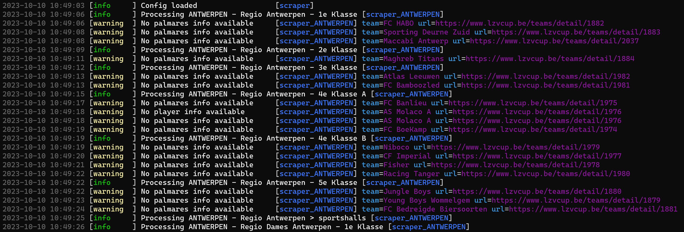

# _Futsal Friend_: Your Digital Futsal Companion

:trophy: Do you need an opponent for a friendly?

:couple: Do you want to find a team as a new player?

:smirk: Do you care to analyse vanity statistics?

:mega: Do you desire to receive jolly tactical advice?

**Futsal Friend** is a small web application built using player and competition data from [Liefhebbers Zaalvoetbal Cup](https://www.lzvcup.be/) (LZV Cup), a Belgian futsal organisation counting over 900 teams. Its usefulness is not limited to players from one of the LZV Cup leagues.

## Scraping

The data comes from the [lzvcup.be](https://www.lzvcup.be/) website. Scraping it goes according to the steps defined here.
- **Step 1** - Define a set of main URLs in a config file. Each URL represents a region, which will serve as the starting point. See the `config.json` file.
- **Step 2** - For each of the areas, go to the URL and grab the so-called region cards which list the competitions and sportshalls in every region. Then extract the URLs for the respective _competitions_ pages (e.g. 2e Klasse) and the single URL for the overview of sportshalls page.
- **Step 3** - Go to each competition's URL and gather following information:
    - The _schedule_ (the games played and their scores, as well as the games planned);
    - The competition's _standings_;
    - The _teams_ and their page URL.
- **Step 4** - For each of the team's page URL, grab following information:
    - The players and their _current season's statistics_ (such as games played or goals scored, and also every player's page URL);
    - The _palmares_ of the team (i.e. the competition positions they achieved in the past).
- **Step 5** - Go to each region-specific sportshall's page URL and parse all _individual sportshalls_ together with metadata like address and email address. 
- **Step 6** - Go to each of the player's page URL and grab their _historical statistics_.
- **Step 7** - Transform all the scraped data into a few tables with relevant metadata (for instance, area and region).
- **Step 8** - Store the tables in a database (SQLite or on the cloud).

All relevant code is in the `scraper/` folder. You can call `make scrape` to run the full scraping script `main.py`. It takes around 15-20 minutes.

The main scraping script also includes some nice logging. See below! For more information about the logging setup, this [Medium post](https://medium.com/@sborms/while-my-python-script-gently-logs-2a3491338ecd) helps.

  

## Main technologies

<!--  -->
